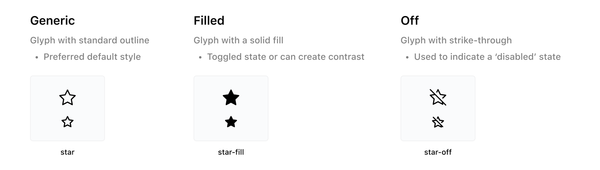
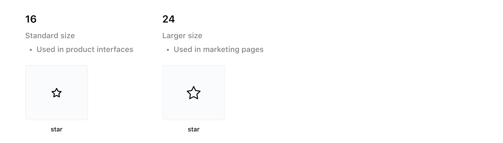
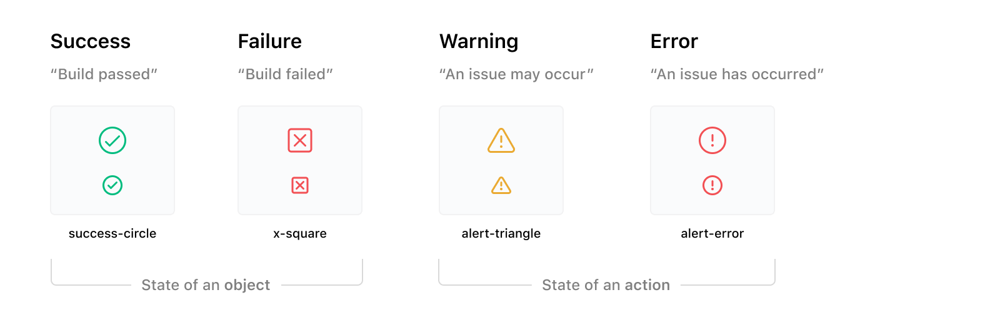
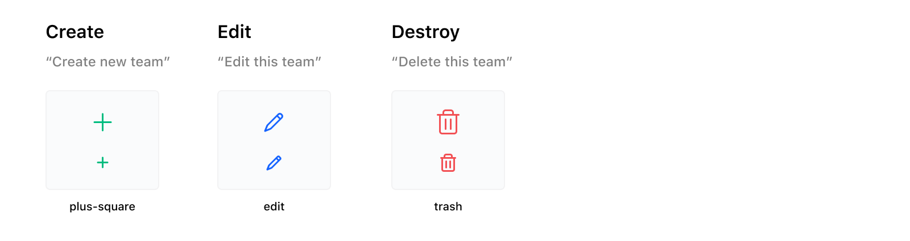

# Flight

## Website

You can view and search the list of available icons at this URL:

https://flight-staging.vercel.app/

_Notice: we have built this micro-website as quick reference for designers and developers; later will likely be embedded in a fully fledged "design system" website._

## Consumer instructions

### How to consume @hashicorp/ember-flight-icons

🚨 Note: npm addon is currently in beta and not intended for production use yet.

Please see [ember-flight-icons/README](ember-flight-icons/README.md). This addon can be used in Ember apps.

### How to consume @hashicorp/flight-icons

🚨 Note: npm addon is currently in beta and not intended for production use yet.

Please see [flight-icons/README](flight-icons/README.md). This addon can be used in React or Ember apps.

### How to consume an icon in Figma

1. Open your project file within Figma
2. Navigate to the Assets panel in the left sidebar
3. Enable the [Flight Icons](https://www.figma.com/file/TLnoT5AYQfy3tZ0H68BgOr/Flight-Icons?node-id=164%3A0) Library  
_Click the Team library icon (looks like an open book), toggle on Flight Icons_
4. Search or scroll to find the icon you want to use and drag it into your file

💡 Tip: Swapping instances, sizes, and colors is easy to do from the right sidebar

## Best Practices

### Icon Types

* Use the `Generic` style icons by default
* Use the `Filled` style if indicating the toggled state of an icon
* Use the `Filled` style where contrast against other icons is important
* Use the `Off` style icons to indicate a disabled state

### Icon Sizes

* Use the `16px` size in product interfaces
* Use the `24px` size in marketing pages

#### Guidance

:white_check_mark: Display icons at either `16px` or `24px`  
:white_check_mark: Use `16px` icons by default in product interfaces  
:white_check_mark: Consider using `24px` icons in product interfaces for empty states  
:warning: Take care if choosing to display icons at sizes other than `16px` and `24px`  
_There may be cases where 16px and 24px values don't fit a design - Flight icons can be resized in these cases but be aware that the design is not optimized for values other than these_

#### Updating existing interfaces

:white_check_mark: Where the current icon size is less than or equal to `20px`, replace icons with `16px` versions  
:white_check_mark: If the size of icon to be replaced is at least `21px`, first try to replace it with a `24px` version  
_If 24px seems too large, consider dropping down to 16px and reworking the interface for a better fit_

### States

Some common state icons that get used within the products include:  

### Actions

Some common action icons that get used within the products include:  

## Contributing

See the [Contributing](CONTRIBUTING.md) guide for details.

### How to contribute a new icon in Figma (HashiCorp staff only)

1. [Open a GitHub issue](https://github.com/hashicorp/flight/issues/new?assignees=&labels=enhancement%2C+triage&template=icon-request.md&title=Flight+Icon+Request%3A+%5Bicon-name%5D) to kick-off work on adding a new icon  

2. If you're ready to develop the new icon, create a new branch within [✏️Flight Development](https://www.figma.com/file/MYiw4kiVpunIMMw0sBkE1t/%E2%9C%8F%EF%B8%8F-Flight-Development?node-id=205%3A0)  
_You can do this from the Main menu (File > Create branch...)_  
_Take care to avoid working directly in the default branch!_

3. Use the template component in the `Flight Icons - Dev` frame  
_Keep your work in this frame, but feel free to create as many versions with that template component as you need._

4. Draw your icon glyph using vectors  
_Be sure to follow the design guide in the Figma file, taking care to follow the conventions around strokes, corner radius and aligning to the grid. Try to preserve the ability to edit the glyph where possible (avoid flattening)._

5. When your icon is ready, post to the original GitHub issue to close the loop  
_The Design Systems team will then add the icon to the grid, productionize it, and publish from the [production file](https://www.figma.com/file/TLnoT5AYQfy3tZ0H68BgOr/Flight-Icons?node-id=164%3A0)._

## License

This project is licensed under the [Mozilla Public License 2.0](LICENSE.md).

## Versioning

We use [SemVer](http://semver.org/) for versioning.